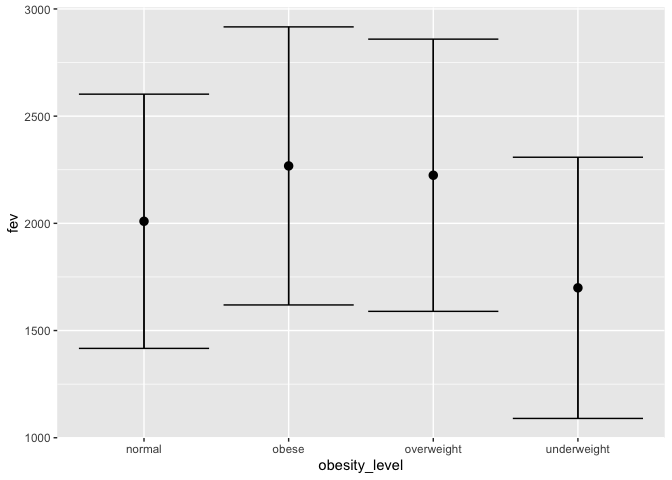
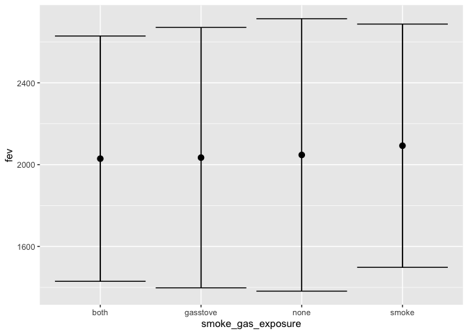
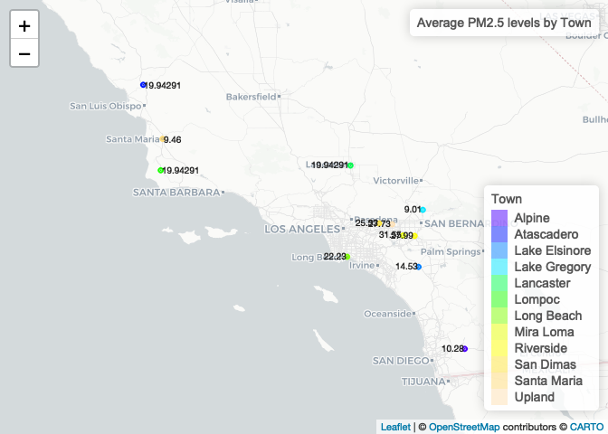
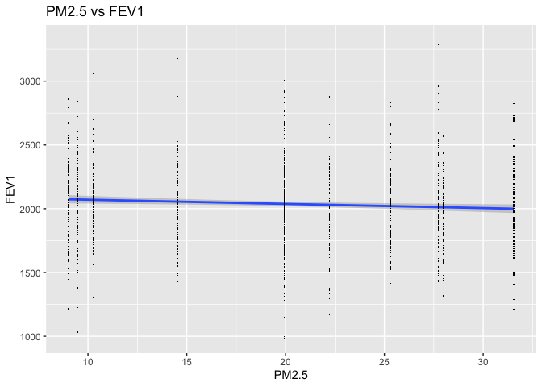

HW01: PM2.5 concentration in California 2004 vs 2019
================
VY
2022-10-06

# HW02

## Data Wrangling

``` r
indchs <- read.csv(file = "https://raw.githubusercontent.com/USCbiostats/data-science-data/master/01_chs/chs_individual.csv")
regchs <- read.csv(file = "https://raw.githubusercontent.com/USCbiostats/data-science-data/master/01_chs/chs_regional.csv")
chs <- merge(indchs, regchs, by.x = "townname", by.y = "townname")
chs <- data.table(chs)
```

## 1. After merging the data, make sure you don’t have any duplicates by counting the number of rows. Make sure it matches.

In the case of missing values, impute data using the average within the
variables “male” and “hispanic.” If you are interested (and feel
adventurous) in the theme of Data Imputation, take a look at this paper
on “Multiple Imputation” using the Amelia R package here.

## The individual dataset had 1200 rows and the regional dataset had 12 rows. The merged dataset has 1200 rows, so no data was lost.

``` r
summary(chs)
```

    ##    townname              sid              male            race          
    ##  Length:1200        Min.   :   1.0   Min.   :0.0000   Length:1200       
    ##  Class :character   1st Qu.: 528.8   1st Qu.:0.0000   Class :character  
    ##  Mode  :character   Median :1041.5   Median :0.0000   Mode  :character  
    ##                     Mean   :1037.5   Mean   :0.4917                     
    ##                     3rd Qu.:1554.2   3rd Qu.:1.0000                     
    ##                     Max.   :2053.0   Max.   :1.0000                     
    ##                                                                         
    ##     hispanic          agepft           height        weight      
    ##  Min.   :0.0000   Min.   : 8.961   Min.   :114   Min.   : 42.00  
    ##  1st Qu.:0.0000   1st Qu.: 9.610   1st Qu.:135   1st Qu.: 65.00  
    ##  Median :0.0000   Median : 9.906   Median :139   Median : 74.00  
    ##  Mean   :0.4342   Mean   : 9.924   Mean   :139   Mean   : 79.33  
    ##  3rd Qu.:1.0000   3rd Qu.:10.177   3rd Qu.:143   3rd Qu.: 89.00  
    ##  Max.   :1.0000   Max.   :12.731   Max.   :165   Max.   :207.00  
    ##                   NA's   :89       NA's   :89    NA's   :89      
    ##       bmi            asthma       active_asthma  father_asthma    
    ##  Min.   :11.30   Min.   :0.0000   Min.   :0.00   Min.   :0.00000  
    ##  1st Qu.:15.78   1st Qu.:0.0000   1st Qu.:0.00   1st Qu.:0.00000  
    ##  Median :17.48   Median :0.0000   Median :0.00   Median :0.00000  
    ##  Mean   :18.50   Mean   :0.1463   Mean   :0.19   Mean   :0.08318  
    ##  3rd Qu.:20.35   3rd Qu.:0.0000   3rd Qu.:0.00   3rd Qu.:0.00000  
    ##  Max.   :41.27   Max.   :1.0000   Max.   :1.00   Max.   :1.00000  
    ##  NA's   :89      NA's   :31                      NA's   :106      
    ##  mother_asthma        wheeze          hayfever         allergy      
    ##  Min.   :0.0000   Min.   :0.0000   Min.   :0.0000   Min.   :0.0000  
    ##  1st Qu.:0.0000   1st Qu.:0.0000   1st Qu.:0.0000   1st Qu.:0.0000  
    ##  Median :0.0000   Median :0.0000   Median :0.0000   Median :0.0000  
    ##  Mean   :0.1023   Mean   :0.3313   Mean   :0.1747   Mean   :0.2929  
    ##  3rd Qu.:0.0000   3rd Qu.:1.0000   3rd Qu.:0.0000   3rd Qu.:1.0000  
    ##  Max.   :1.0000   Max.   :1.0000   Max.   :1.0000   Max.   :1.0000  
    ##  NA's   :56       NA's   :71       NA's   :118      NA's   :63      
    ##   educ_parent        smoke             pets           gasstove     
    ##  Min.   :1.000   Min.   :0.0000   Min.   :0.0000   Min.   :0.0000  
    ##  1st Qu.:2.000   1st Qu.:0.0000   1st Qu.:1.0000   1st Qu.:1.0000  
    ##  Median :3.000   Median :0.0000   Median :1.0000   Median :1.0000  
    ##  Mean   :2.797   Mean   :0.1638   Mean   :0.7667   Mean   :0.7815  
    ##  3rd Qu.:3.000   3rd Qu.:0.0000   3rd Qu.:1.0000   3rd Qu.:1.0000  
    ##  Max.   :5.000   Max.   :1.0000   Max.   :1.0000   Max.   :1.0000  
    ##  NA's   :64      NA's   :40                        NA's   :33      
    ##       fev              fvc            mmef          pm25_mass     
    ##  Min.   : 984.8   Min.   : 895   Min.   : 757.6   Min.   : 5.960  
    ##  1st Qu.:1809.0   1st Qu.:2041   1st Qu.:1994.0   1st Qu.: 7.615  
    ##  Median :2022.7   Median :2293   Median :2401.5   Median :10.545  
    ##  Mean   :2031.3   Mean   :2324   Mean   :2398.8   Mean   :14.362  
    ##  3rd Qu.:2249.7   3rd Qu.:2573   3rd Qu.:2793.8   3rd Qu.:20.988  
    ##  Max.   :3323.7   Max.   :3698   Max.   :4935.9   Max.   :29.970  
    ##  NA's   :95       NA's   :97     NA's   :106                      
    ##     pm25_so4        pm25_no3         pm25_nh4         pm25_oc      
    ##  Min.   :0.790   Min.   : 0.730   Min.   :0.4100   Min.   : 1.450  
    ##  1st Qu.:1.077   1st Qu.: 1.538   1st Qu.:0.7375   1st Qu.: 2.520  
    ##  Median :1.815   Median : 2.525   Median :1.1350   Median : 4.035  
    ##  Mean   :1.876   Mean   : 4.488   Mean   :1.7642   Mean   : 4.551  
    ##  3rd Qu.:2.605   3rd Qu.: 7.338   3rd Qu.:2.7725   3rd Qu.: 5.350  
    ##  Max.   :3.230   Max.   :12.200   Max.   :4.2500   Max.   :11.830  
    ##                                                                    
    ##     pm25_ec          pm25_om          pm10_oc          pm10_ec      
    ##  Min.   :0.1300   Min.   : 1.740   Min.   : 1.860   Min.   :0.1400  
    ##  1st Qu.:0.4000   1st Qu.: 3.020   1st Qu.: 3.228   1st Qu.:0.4100  
    ##  Median :0.5850   Median : 4.840   Median : 5.170   Median :0.5950  
    ##  Mean   :0.7358   Mean   : 5.460   Mean   : 5.832   Mean   :0.7525  
    ##  3rd Qu.:1.1750   3rd Qu.: 6.418   3rd Qu.: 6.855   3rd Qu.:1.1975  
    ##  Max.   :1.3600   Max.   :14.200   Max.   :15.160   Max.   :1.3900  
    ##                                                                     
    ##     pm10_tc           formic          acetic           hcl        
    ##  Min.   : 1.990   Min.   :0.340   Min.   :0.750   Min.   :0.2200  
    ##  1st Qu.: 3.705   1st Qu.:0.720   1st Qu.:2.297   1st Qu.:0.3250  
    ##  Median : 6.505   Median :1.105   Median :2.910   Median :0.4350  
    ##  Mean   : 6.784   Mean   :1.332   Mean   :3.010   Mean   :0.4208  
    ##  3rd Qu.: 8.430   3rd Qu.:1.765   3rd Qu.:4.000   3rd Qu.:0.4625  
    ##  Max.   :16.440   Max.   :2.770   Max.   :5.140   Max.   :0.7300  
    ##                                                                   
    ##       hno3           o3_max          o3106           o3_24      
    ##  Min.   :0.430   Min.   :38.27   Min.   :28.22   Min.   :18.22  
    ##  1st Qu.:1.593   1st Qu.:49.93   1st Qu.:41.90   1st Qu.:23.31  
    ##  Median :2.455   Median :64.05   Median :46.74   Median :27.59  
    ##  Mean   :2.367   Mean   :60.16   Mean   :47.76   Mean   :30.23  
    ##  3rd Qu.:3.355   3rd Qu.:67.69   3rd Qu.:55.24   3rd Qu.:32.39  
    ##  Max.   :4.070   Max.   :84.44   Max.   :67.01   Max.   :57.76  
    ##                                                                 
    ##       no2             pm10          no_24hr         pm2_5_fr    
    ##  Min.   : 4.60   Min.   :18.40   Min.   : 2.05   Min.   : 9.01  
    ##  1st Qu.:12.12   1st Qu.:20.71   1st Qu.: 4.74   1st Qu.:10.28  
    ##  Median :16.40   Median :29.64   Median :12.68   Median :22.23  
    ##  Mean   :18.99   Mean   :32.64   Mean   :16.21   Mean   :19.79  
    ##  3rd Qu.:23.24   3rd Qu.:39.16   3rd Qu.:26.90   3rd Qu.:27.73  
    ##  Max.   :37.97   Max.   :70.39   Max.   :42.95   Max.   :31.55  
    ##                                  NA's   :100     NA's   :300    
    ##      iacid           oacid        total_acids          lon        
    ##  Min.   :0.760   Min.   :1.090   Min.   : 1.520   Min.   :-120.7  
    ##  1st Qu.:1.835   1st Qu.:2.978   1st Qu.: 4.930   1st Qu.:-118.8  
    ##  Median :2.825   Median :4.135   Median : 6.370   Median :-117.7  
    ##  Mean   :2.788   Mean   :4.342   Mean   : 6.708   Mean   :-118.3  
    ##  3rd Qu.:3.817   3rd Qu.:5.982   3rd Qu.: 9.395   3rd Qu.:-117.4  
    ##  Max.   :4.620   Max.   :7.400   Max.   :11.430   Max.   :-116.8  
    ##                                                                   
    ##       lat       
    ##  Min.   :32.84  
    ##  1st Qu.:33.93  
    ##  Median :34.10  
    ##  Mean   :34.20  
    ##  3rd Qu.:34.65  
    ##  Max.   :35.49  
    ## 

``` r
# agepft height weight bmi asthma father_asthma mother_asthma wheeze hayfever allergy educ_parent smoke gasstove fev fvc mmef no_24hr pm2_5_fr have missing data
hismalemean <- chs[hispanic==1 & male==1]
hismaleval <- rbind(agepftm = mean(hismalemean$agepft, na.rm=T), heightm = mean(hismalemean$height, na.rm=T), weightm =mean(hismalemean$weight, na.rm=T), bmim=mean(hismalemean$bmi, na.rm=T), asthmam =mean(hismalemean$asthma, na.rm=T), father_asthmam =mean(hismalemean$father_asthma, na.rm=T), mother_asthmam =mean(hismalemean$mother_asthma, na.rm=T), wheezem =mean(hismalemean$wheeze, na.rm=T), hayfeverm =mean(hismalemean$hayfever, na.rm=T), allergym =mean(hismalemean$allergy, na.rm=T), educ_parentm =mean(hismalemean$educ_parent, na.rm=T), smokem =mean(hismalemean$smoke, na.rm=T), gasstovem =mean(hismalemean$gasstove, na.rm=T), fevm =mean(hismalemean$fev, na.rm=T), fvcm =mean(hismalemean$fvc, na.rm=T), mmefm =mean(hismalemean$mmef, na.rm=T), no_24hrm =mean(hismalemean$no_24hr, na.rm=T), pm2_5_frm =mean(hismalemean$pm2_5_fr, na.rm=T))
chs1 <- chs[ , agepft := replace(agepft, is.na(agepft), 9.966942e+00)]
chs1 <- chs[,          height := replace(height, is.na(height), 1.385984e+02)]
chs1 <- chs[,  weight := replace(weight, is.na(weight), 8.276707e+01)]
chs1 <- chs[, bmi := replace(bmi, is.na(bmi), 1.941148e+01)]
chs1 <- chs[, asthma := replace(asthma, is.na(asthma), 1.601562e-01)]
chs1 <- chs[, father_asthma := replace(father_asthma, is.na(father_asthma), 8.403361e-02)]
chs1 <- chs[,  mother_asthma := replace(mother_asthma, is.na(mother_asthma), 1.067194e-01)]
chs1 <- chs[,  wheeze := replace(wheeze, is.na(wheeze), 3.534137e-01)]
chs1 <- chs[,  hayfever := replace(hayfever, is.na(hayfever), 1.744681e-01)]
chs1 <- chs[, allergy := replace(allergy, is.na(allergy), 2.540323e-01)]
chs1 <- chs[,  educ_parent := replace(educ_parent, is.na(educ_parent), 2.423868e+00)]
chs1 <- chs[, smoke := replace(smoke, is.na(smoke), 1.501976e-01)]
chs1 <- chs[, gasstove := replace(gasstove, is.na(gasstove), 8.156863e-01)]
chs1 <- chs[,  fev := replace(fev, is.na(fev), 2.120266e+03)]
chs1 <- chs[, fvc := replace(fvc, is.na(fvc), 2.443876e+03)]
chs1 <- chs[, mmef := replace(mmef, is.na(mmef), 2.447494e+03)]
chs1 <- chs[, no_24hr := replace(no_24hr, is.na(no_24hr), 1.586585e+01)]
chs1 <- chs[, pm2_5_fr := replace(pm2_5_fr, is.na(pm2_5_fr), 1.994291e+01)]
```

The original dataset had 1636 missing values. After replacing NAs, there
are 0 missing values.

## 2. Create a new categorical variable named “obesity_level” using the BMI measurement (underweight BMI\<14; normal BMI 14-22; overweight BMI 22-24; obese BMI\>24). To make sure the variable is rightly coded, create a summary table that contains the minimum BMI, maximum BMI, and the total number of observations per category.

``` r
chs1 <- mutate(chs1, obesity_level = ifelse(chs1$bmi<14, "underweight", ifelse(14<=chs1$bmi & chs1$bmi < 22, "normal", ifelse(22<=chs1$bmi & chs1$bmi < 24, "overweight", ifelse(chs1$bmi>=24, "obese", NA)))))
chs1 %>% group_by(obesity_level) %>% summarize(mean_bmi = mean(bmi), min_bmi = min(bmi), max_bmi = max(bmi), n_bmi = n()) %>%
  knitr::kable()
```

| obesity_level | mean_bmi |  min_bmi |  max_bmi | n_bmi |
|:--------------|---------:|---------:|---------:|------:|
| normal        | 17.48342 | 14.00380 | 21.96387 |   975 |
| obese         | 26.97446 | 24.00647 | 41.26613 |   103 |
| overweight    | 22.93748 | 22.02353 | 23.99650 |    87 |
| underweight   | 13.32074 | 11.29640 | 13.98601 |    35 |

## 3. Create another categorical variable named “smoke_gas_exposure” that summarizes “Second Hand Smoke” and “Gas Stove.” The variable should have four categories in total.

``` r
chs1 <- mutate(chs1, smoke_gas_exposure = ifelse(smoke==1 & gasstove==1, "both", ifelse(smoke==1, "smoke", ifelse(gasstove==1, "gasstove", "none"))))
table(chs1$smoke_gas_exposure)
```

    ## 
    ##     both gasstove     none    smoke 
    ##      151      761      249       39

## 4. Create four summary tables showing the average (or proportion, if binary) and sd of “Forced expiratory volume in 1 second (ml)” and asthma indicator by town, sex, obesity level, and “smoke_gas_exposure.”

``` r
townsum <- chs1 %>% group_by(townname) %>% summarise(mean_fev = mean(fev), sd_fev = sd(fev), freq_asthma = sum(asthma)/ n()) %>% distinct(townname, .keep_all = TRUE) 
townsum%>% knitr::kable()
```

| townname      | mean_fev |   sd_fev | freq_asthma |
|:--------------|---------:|---------:|------------:|
| Alpine        | 2090.576 | 290.6565 |   0.1148047 |
| Atascadero    | 2081.418 | 323.5128 |   0.2532031 |
| Lake Elsinore | 2047.030 | 303.7138 |   0.1280078 |
| Lake Gregory  | 2094.811 | 318.6348 |   0.1516016 |
| Lancaster     | 2016.676 | 318.3450 |   0.1648047 |
| Lompoc        | 2045.610 | 351.1411 |   0.1148047 |
| Long Beach    | 1993.442 | 320.6366 |   0.1364062 |
| Mira Loma     | 1994.214 | 326.3779 |   0.1580078 |
| Riverside     | 1998.277 | 278.9353 |   0.1100000 |
| San Dimas     | 2029.655 | 318.9705 |   0.1716016 |
| Santa Maria   | 2033.301 | 312.6835 |   0.1348047 |
| Upland        | 2034.723 | 343.4018 |   0.1216016 |

``` r
sexsum <- chs1 %>% group_by(male) %>% summarise(mean_fev = mean(fev), sd_fev = sd(fev), freq_asthma = sum(asthma)/ n()) %>% distinct(male, .keep_all = TRUE) 
sexsum%>% knitr::kable()
```

| male | mean_fev |   sd_fev | freq_asthma |
|-----:|---------:|---------:|------------:|
|    0 | 1973.900 | 315.3421 |   0.1217085 |
|    1 | 2104.906 | 307.5156 |   0.1724113 |

``` r
obesitysum <- chs1 %>% group_by(obesity_level) %>% summarise(mean_fev = mean(fev), sd_fev = sd(fev), freq_asthma = sum(asthma)/ n()) %>% distinct(obesity_level, .keep_all = TRUE) 
obesitysum%>% knitr::kable()
```

| obesity_level | mean_fev |   sd_fev | freq_asthma |
|:--------------|---------:|---------:|------------:|
| normal        | 2009.639 | 296.4532 |   0.1406811 |
| obese         | 2267.848 | 324.2386 |   0.2085482 |
| overweight    | 2224.322 | 317.4261 |   0.1646013 |
| underweight   | 1699.185 | 304.5785 |   0.0857143 |

``` r
smokegassum <- chs1 %>% group_by(smoke_gas_exposure) %>% summarise(mean_fev = mean(fev), sd_fev = sd(fev), freq_asthma = sum(asthma)/ n()) %>% distinct(smoke_gas_exposure, .keep_all = TRUE) 
smokegassum %>% knitr::kable()
```

| smoke_gas_exposure | mean_fev |   sd_fev | freq_asthma |
|:-------------------|---------:|---------:|------------:|
| both               | 2029.273 | 299.6817 |   0.1311310 |
| gasstove           | 2034.331 | 318.1718 |   0.1492793 |
| none               | 2047.460 | 332.8773 |   0.1461941 |
| smoke              | 2092.556 | 297.2326 |   0.1579527 |

# Exploratory Data Analysis

## The primary questions of interest are: 1. What is the association between BMI and FEV (forced expiratory volume)? 2. What is the association between smoke and gas exposure and FEV? 3. What is the association between PM2.5 exposure and FEV?

## Check for any implausible values

``` r
summary(chs1$bmi)
```

    ##    Min. 1st Qu.  Median    Mean 3rd Qu.    Max. 
    ##   11.30   15.96   17.81   18.57   19.99   41.27

``` r
summary(chs1$fev)
```

    ##    Min. 1st Qu.  Median    Mean 3rd Qu.    Max. 
    ##   984.8  1827.6  2060.1  2038.3  2223.6  3323.7

``` r
summary(chs1$pm2_5_fr)
```

    ##    Min. 1st Qu.  Median    Mean 3rd Qu.    Max. 
    ##    9.01   13.47   19.94   19.83   25.93   31.55

``` r
histobmi <- ggplot(chs1, aes(x=bmi)) +
  geom_histogram(binwidth=0.5, fill="blue", position="dodge") +
  theme(legend.position="right")
histobmi
```

<!-- -->

``` r
histofev <- ggplot(chs1, aes(x=fev)) +
  geom_histogram(binwidth=10, fill="red", position="dodge") +
  theme(legend.position="right")
histofev
```

<!-- -->

``` r
histopm2.5 <- chs1 %>% ggplot(aes(x=pm2_5_fr)) +
  geom_histogram(binwidth=2, fill="green", position="dodge") +
  theme(legend.position="right")
histopm2.5
```

<!-- -->

There is a peak bmi at 19.41, peak fev at 2120.3, and peak PM2.5 at 19.9
because the missing values were assigned the average value of a Hispanic
male.

## 1. Facet plot showing scatterplots with regression lines of BMI vs FEV by “townname”.

``` r
chs1 %>% ggplot(aes(x=bmi, y=fev, group=townname, color=townname)) +
  stat_smooth(method = "lm", formula = y ~ x, geom="smooth") +
  geom_point(shape= ".") +
  theme(legend.position="right") +
  facet_wrap(vars(townname), nrow = 4) +
  ggtitle("BMI vs FEV1 by town") +
  xlab("BMI") +
  ylab("FEV1")
```

<!-- -->

Interpretation: BMI and FEV1 appear to have a positive linear
relationship, regardless of town. The towns where the positive linear
relationship looks the most significant are San Dias and Lake Elsinore.

## 2. Stacked histograms of FEV by BMI category and FEV by smoke/gas exposure. Use different color schemes than the ggplot default.

``` r
fevobhisto <- chs1 %>% ggplot(aes(x=fev, group=obesity_level, fill=obesity_level)) +
  geom_histogram(position = "stack", binwidth = 10) +
  scale_fill_manual(values = c("cyan3", "orange", "yellow", "deeppink")) +
  ggtitle("Distribution of FEV1 by BMI category") +
  labs(fill= "BMI Category")
fevobhisto
```

<!-- -->

``` r
fevsmg <- chs1 %>% ggplot(aes(x=fev, group=smoke_gas_exposure, fill=smoke_gas_exposure)) +
  geom_histogram(position = "stack", binwidth = 20) +
  scale_fill_manual(values = c("coral", "bisque", "chocolate", "darksalmon")) +
  ggtitle("Distribution of FEV1 by Smoke or Gas exposure") +
  labs(fill= "Presence of smoke/gas/both exposure")
fevsmg
```

<!-- -->

Interpretation: There is a clear mode at 2120.3, the value of the
imputed data. Otherwise, it appears that presence of smoke or gas or
both exposure do not have significantly different distributions of FEV1.

## 3. Barchart of BMI by smoke/gas exposure.

``` r
bmismg <- chs1 %>% ggplot(aes(x=bmi, group=smoke_gas_exposure, fill=smoke_gas_exposure)) +
  geom_histogram(position = "stack", binwidth = 0.2) +
  ggtitle("Distribution of BMI by Smoke or Gas exposure") +
  labs(fill= "Presence of smoke/gas/both exposure")
bmismg
```

<!-- -->

Interpretation: Again, the imputed mean Hispanic male BMI is a clear
mode. It appears that the distribution of bmi in all smoke/gas exposure
categories appears similar. However, the tail appears to be of only
subjects with gasstove or both exposure.

## 4. Statistical summary graphs of FEV by BMI category and FEV by smoke/gas exposure category.

``` r
bmiavg <- chs1[ , .(mean_fev = mean(fev)), by = "obesity_level"]
bmiavg %>% knitr::kable()
```

| obesity_level | mean_fev |
|:--------------|---------:|
| normal        | 2009.639 |
| obese         | 2267.848 |
| overweight    | 2224.322 |
| underweight   | 1699.185 |

``` r
chs1 %>% ggplot(mapping = aes(x = obesity_level, y = fev)) +
  stat_summary(fun.data = mean_sdl, geom = "pointrange") +
  stat_summary(fun.data = mean_sdl, geom = "errorbar")
```

<!-- -->

``` r
sgeavg <- chs1[ , .(mean_fev = mean(fev)), by = "smoke_gas_exposure"]
sgeavg %>% knitr::kable()
```

| smoke_gas_exposure | mean_fev |
|:-------------------|---------:|
| none               | 2047.460 |
| gasstove           | 2034.331 |
| smoke              | 2092.556 |
| both               | 2029.273 |

``` r
chs1 %>% ggplot(mapping = aes(x = smoke_gas_exposure, y = fev)) +
  stat_summary(fun.data = mean_sdl, geom = "pointrange") +
  stat_summary(fun.data = mean_sdl, geom = "errorbar")
```

<!-- -->

Interpretation: Obese and overweight children appear to have higher
FEV1, where as normal and underweight BMI categories have lower FEV1.

There does not appear to be a relationship between smoke/gas exposure
and FEV1. The average FEV1 by exposure appears similar in value, with
smoke exposure only having a slightly higher FEV1.

## 5. A leaflet map showing the concentrations of PM2.5 mass in each of the CHS communities.

``` r
pm.pal <- colorFactor(topo.colors(12), domain=chs1$townname)
pm.pal
```

    ## function (x) 
    ## {
    ##     if (length(x) == 0 || all(is.na(x))) {
    ##         return(rep.int(na.color, length(x)))
    ##     }
    ##     lvls <- getLevels(domain, x, lvls, ordered)
    ##     pf <- safePaletteFunc(palette, na.color, alpha, nlevels = length(lvls) * 
    ##         ifelse(reverse, -1, 1))
    ##     origNa <- is.na(x)
    ##     x <- match(as.character(x), lvls)
    ##     if (any(is.na(x) != origNa)) {
    ##         warning("Some values were outside the color scale and will be treated as NA")
    ##     }
    ##     scaled <- scales::rescale(as.integer(x), from = c(1, length(lvls)))
    ##     if (any(scaled < 0 | scaled > 1, na.rm = TRUE)) {
    ##         warning("Some values were outside the color scale and will be treated as NA")
    ##     }
    ##     if (reverse) {
    ##         scaled <- 1 - scaled
    ##     }
    ##     pf(scaled)
    ## }
    ## <bytecode: 0x7f9df299ea10>
    ## <environment: 0x7f9df29a00e0>
    ## attr(,"colorType")
    ## [1] "factor"
    ## attr(,"colorArgs")
    ## attr(,"colorArgs")$na.color
    ## [1] "#808080"

``` r
pmmap <- chs1 %>% group_by(townname) %>% mutate(mean_pm2.5 = mean(pm2_5_fr)) %>% distinct(townname, .keep_all = TRUE) %>% leaflet() %>%
  addProviderTiles("CartoDB.Positron") %>%
  addCircles(
    lat=~lat, lng=~lon,
    label=~paste0(mean_pm2.5), labelOptions = labelOptions(noHide = T, textOnly = TRUE), color = ~pm.pal(townname),
    opacity = 1, fillOpacity = 1, radius = 500
    ) %>%
  addLegend("bottomright", pal=pm.pal, values= chs1$townname, title = "Town") %>%
  addControl("Average PM2.5 levels by Town", position = "topright")
pmmap
```

<!-- -->

Interpretation: The highest mean PM2.5 levels appear to be clustered
around LA, especially NE of LA.

## 6. Choose a visualization to examine whether PM2.5 mass is associated with FEV.

``` r
chs1 %>% ggplot(aes(x=pm2_5_fr, y=fev)) +
  stat_smooth(method = "lm", formula = y ~ x, geom="smooth") +
  geom_point(shape= ".") +
  theme(legend.position="right") +
  ggtitle("PM2.5 vs FEV1") +
  xlab("PM2.5") +
  ylab("FEV1")
```

<!-- -->

Interpretation: There appears to be a slightly negative relationship
between FEV1 and PM2.5, where higher levels of PM2.5 are associated with
slightly lower average FEV1.
